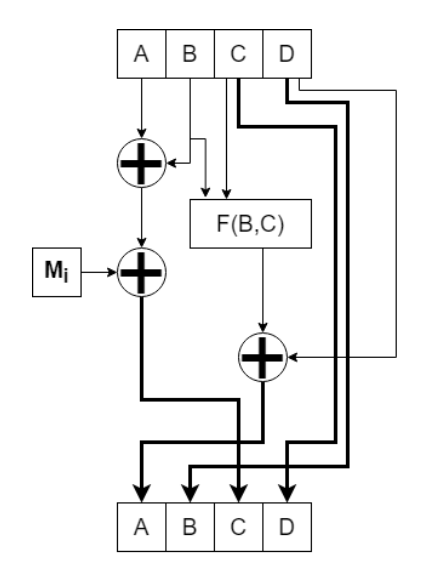

  
# KIV/BIT task 05 - Simple hash algorithm

## Compilation

The compilation process is done through the `make`command that's supposed to be executed in the root folder of the project structure. Once the process has completed, a file called `hash_BIT` will be generated. This file represents the executable file of the application.

## Execution

### help
```
> ./hash_BIT --help
KIV/BIT task 5 - implementation of a simple hash function
Usage:
  ./hash_BIT <input> [OPTION...]

  -v, --verbose  print out info as the program proceeds
  -h, --help     print help
>
```
### input
The program takes one required parameter, which happens to be the `input file` used to calculate the has value. There's no limitation as to what type the file should be. It can be both a text file or a binary file.

### output
The output is represented by a single value printed out on the screen. This 64-bit long number represents the final hash value of the file given as a parameter. For example, `fa0513e1aa06b891`. 
### Examples of execution
```
./hash_BIT input/input.txt -v
./hash_BIT input/dwarf_small.bmp
```
## Implementation
The algorithm of calculating the hash value of the the input file works the following way:
1.  The content of the input file is read off into a buffer  `std::vector<uint8_t> buffer`.
2. Since the input of the hash algorithm is made up by 4 values, the input buffer needs to be processed in blocks of a size of 16 bits  (4 * 16 bits = 64 bits).
```
1011 1001 1111 1110 # data read off the input file
```
```
block_1 = 10111001  # first block used in the algorithm
block_2 = 11111110	# second block used in the algorithm
```
3. The initial values of the variables `A`, `B`, `C`, and `D` (initialization vector) are 
```
A = 0010 1110 1100 0000
B = 1110 0011 1011 1100
C = 1111 1101 0001 0111
D = 1010 0001 0011 1111
```
4. The overall number of iterations is determined by the number of blocks in total. Since the size of one block is 16 bits, we can assume that the number of iterations is roughly the size of the file divided by two. If the size of the file is odd, the last block is fixed up by adding zeros at the end.
5. Within each iteration, the algorithm does following operations:

If the index of the current block is even, function `F1` is used. Otherwise, the program uses function `F2`.
```c++
for (int i = 0; i < (int)inputData.size(); i++) {
	f = i & 1 ? F2(prev[B], prev[C]) : F1(prev[B], prev[C]);

	next[A] = f ^ prev[D];
	next[B] = prev[D];
	next[C] = (prev[A] ^ prev[B]) ^ inputData[i];
	next[D] = prev[C];
	memcpy(prev, next, sizeof(next));
}
```